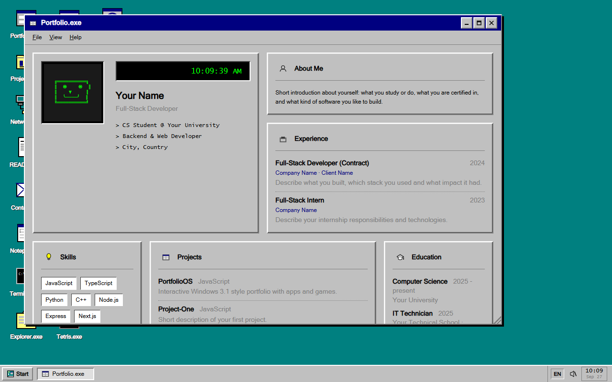
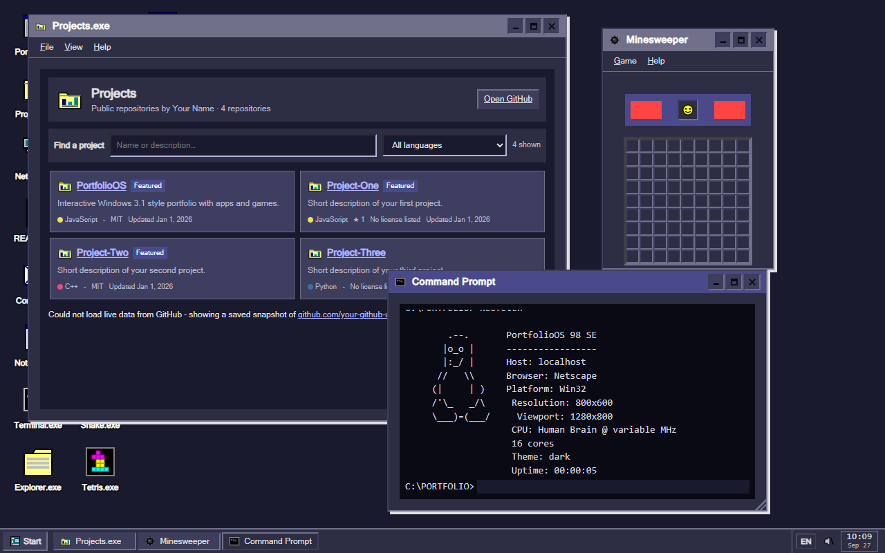
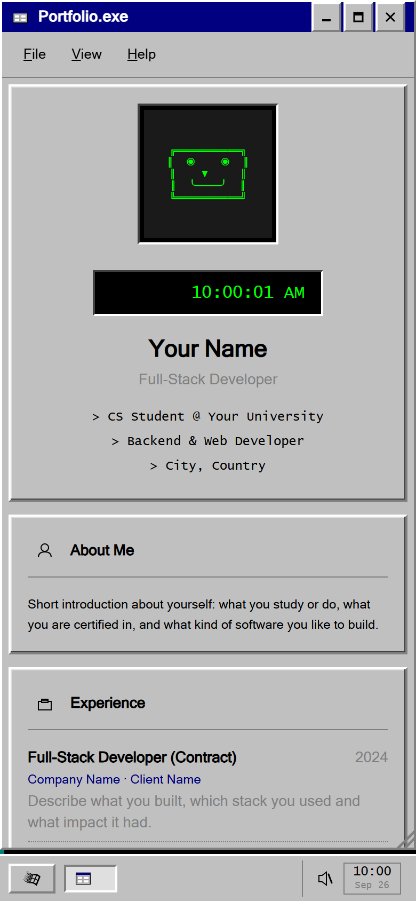

# Portfolio OS

A Windows 3.1 inspired desktop environment that works as an interactive developer portfolio. Built with vanilla HTML, CSS and JavaScript: no frameworks, no build step.




<table>
  <tr>
    <td width="72%"></td>
    <td width="28%"></td>
  </tr>
  <tr>
    <td align="center"><sub>Projects, Minesweeper and Terminal in the Dark theme</sub></td>
    <td align="center"><sub>Mobile layout</sub></td>
  </tr>
</table>

## Features

### Desktop environment
- Draggable, resizable windows with authentic retro styling
- Start menu, taskbar, system tray and clock with calendar popup
- Desktop icons with grid snapping
- Themes: Teal, Dark, Hotdog Stand, Matrix, Clouds, Windows 95/98, macOS, Ubuntu, plus auto dark mode
- CRT effect and optional system sounds
- Screen savers: Matrix, Starfield, Flying logos, 3D Pipes and Mystify (Control Panel > Screen Saver)
- BIOS setup: press DEL during boot (or type `bios` in the Terminal) to change theme, sound, language, quick boot and screen saver
- Session persistence (window positions and open apps, opt-in via local storage)
- English and Polish, switched with the EN/PL button in the taskbar (English by default; the choice is remembered)

### Applications
| App | Description |
| --- | --- |
| **Portfolio.exe** | Main portfolio in a bento grid layout |
| **Projects.exe** | Searchable, filterable list of your repositories, synced live from GitHub; click one to read its README |
| **Network.exe** | Live status of the services you host, plus uptime, load and memory of the server |
| **Simple View** | The portfolio as a clean document, in the same layout as the printable CV |
| **Contact.exe** | Contact form (backed by a small Node.js API) and social links |
| **README.txt** | Welcome screen and usage guide |
| **File Explorer** | Virtual file system with hidden files |
| **Notepad**, **Paint**, **Calculator** | Classic utilities |
| **Terminal** | Fake DOS prompt with custom commands |
| **Internet** | Retro browser: YouTube/Spotify/Vimeo links play in place, Wikipedia search, other sites via the Wayback Machine, and a Time machine to browse the web as it was in 1996-2015 |
| **Tunes** | Embedded Spotify player |
| **Control Panel** | Themes, sounds, screensaver and session settings |
| **System Information**, **Task Manager** | "Hardware" info and running windows |

### Games
- **Minesweeper**
- **Snake** (with touch controls)
- **Tetris** (with swipe and hold to drop)

### Extras
- Download CV prints it on an animated dot-matrix printer, then opens the printable CV (save as PDF)
- Full no-JavaScript version: static portfolio (English and Polish), printable CV and a contact form that works as a plain HTML form
- Link previews (Open Graph / Twitter card) with `og-image.png`
- Easter eggs: Konami code, hidden files, secret terminal commands

## Quick start

No build tools are required. Serve the project root with any static server:

```bash
git clone https://github.com/your-github-username/PortfolioOS.git
cd PortfolioOS
python -m http.server 8000
```

Then open <http://localhost:8000>. Alternatives: `npx serve`, or the VS Code "Live Server" extension.

> Opening `index.html` directly from disk (`file://`) does not work, because browsers block ES module imports there.

The contact form needs the backend (see [Docker deployment](#docker-deployment)). Everything else works as a plain static site.

## Personalization

All personal data lives in a single file: [`js/config.js`](js/config.js). Edit it to make the portfolio yours:

| Field | Used for |
| --- | --- |
| `name`, `firstName`, `initials`, `title`, `location` | Portfolio header, CV, System Info, File Explorer, footers |
| `bio`, `about` | Portfolio hero card and About section |
| `contact.email`, `contact.github`, `contact.discord` | Contact app, Portfolio, CV, Terminal `github` command |
| `experience`, `education`, `skills` | Portfolio, Simple View, CV, `cv.txt` in File Explorer |
| `githubSync` | When `true` (default), Projects.exe loads your public repositories live from the GitHub API, so stars, descriptions and new repos stay up to date |
| `projects` | Offline fallback for Projects.exe; entries with `featured: true` also appear in Portfolio, Simple View and CV |
| `links` | Extra targets for the Terminal `open <name>` command |

Any text value can be a plain string or an `{ en: '...', pl: '...' }` object. Visitors switch language with the EN/PL button in the taskbar; UI strings live in [`js/i18n.js`](js/i18n.js).

After editing `config.js`, regenerate the pages that must work without JavaScript:

```bash
node scripts/build-static.mjs
```

It rewrites the meta tags, structured data and the static portfolio in `index.html` (what search engines and visitors without JavaScript see), and creates `pl.html`, `cv.html`, `cv.pl.html`, `404.html`, `robots.txt`, `sitemap.xml` and the `contact-sent` / `contact-error` pages (Node 18+, no dependencies). Use `--config` and `--out` to build from another config into another folder.

Two things are not generated:

- **`og-image.png`**: the 1200x630 image shown in link previews
- **`js/apps/TunesApp.js`**: the Spotify track in `TRACK`

### Keeping your data out of the repository

If you publish your fork but do not want your personal data in it, keep `config.js` with placeholders and store the real files in a `private/` folder (ignored by git). A `docker-compose.override.yml` in the repo root (also ignored, and loaded automatically by Docker Compose) mounts them over the placeholders:

```yaml
services:
  frontend:
    volumes:
      - ./private/config.js:/usr/share/nginx/html/js/config.js:ro
      - ./private/og-image.png:/usr/share/nginx/html/og-image.png:ro
      - ./private/build/index.html:/usr/share/nginx/html/index.html:ro
      - ./private/build/pl.html:/usr/share/nginx/html/pl.html:ro
      - ./private/build/cv.html:/usr/share/nginx/html/cv.html:ro
      # ...and the other generated pages
```

Generate `private/build` with `node scripts/build-static.mjs --config private/config.js --out private/build`.

## Docker deployment

The repository ships with a two-container setup:

- **frontend**: nginx serving the static files, proxying `/api/*` to the backend
- **backend**: Express + Nodemailer API that sends contact form messages by email

```bash
cp .env.example .env
# fill in your SMTP credentials and CONTACT_EMAIL
docker compose up -d --build
```

The site is then available on port 80.

### Environment variables

| Variable | Description | Default |
| --- | --- | --- |
| `FRONTEND_PORT` | Host port for the website | `80` |
| `SMTP_HOST` | SMTP server | `smtp.gmail.com` |
| `SMTP_PORT` | SMTP port | `587` |
| `SMTP_SECURE` | Use TLS from the start (`true` for port 465) | `false` |
| `SMTP_USER` | SMTP login (also used as the sender address) | none |
| `SMTP_PASS` | SMTP password; for Gmail use an [App Password](https://support.google.com/accounts/answer/185833) | none |
| `CONTACT_EMAIL` | Where contact form messages are delivered | `SMTP_USER` |
| `STATUS_SERVICES` | Services shown in Network.exe, as `Name\|https://url` pairs separated by commas. Without it the app shows that status is unavailable | none |
| `STATUS_HOST_LABEL` | Name shown for the server running the backend | hostname |
| `TURNSTILE_SECRET` | Cloudflare Turnstile secret key; when set, the contact form requires the anti-spam check | none |
| `CORS_ORIGIN` | Allowed origin for the API | `*` |

The backend applies Helmet security headers, input validation, HTML escaping and rate limiting (5 messages per 15 minutes per IP, taken from `CF-Connecting-IP` behind Cloudflare) and a honeypot field.

### Spam protection (Cloudflare Turnstile, optional)

1. In the Cloudflare dashboard open **Turnstile**, add your domain and create a widget.
2. Put the **site key** (public) in `js/config.js` as `turnstileSiteKey` and the **secret key** in `.env` as `TURNSTILE_SECRET`.
3. Rebuild the static pages (`scripts/build-static.mjs`) and restart the containers.

The widget loads only when the Contact window opens and Send stays disabled until it passes. Turnstile needs JavaScript, so with a site key set the no-JS page shows your e-mail address instead of the form. Without a key everything works as before (honeypot and rate limit only).

### Running the backend without Docker

```bash
cd backend
npm install
SMTP_USER=you@example.com SMTP_PASS=your-app-password npm start
```

The frontend calls `/api/contact`, so put a reverse proxy in front of it (see [`nginx.conf`](nginx.conf)) when not using Docker.

## Project structure

```
PortfolioOS/
├── index.html            # App shell, boot screen, desktop markup
├── cv.html, pl.html ...  # Generated no-JS pages (scripts/build-static.mjs)
├── scripts/
│   └── build-static.mjs  # Builds the no-JS pages from js/config.js
├── css/
│   ├── main.css          # Entry point, imports the rest
│   ├── variables.css     # Theme variables
│   └── ...               # base, desktop, window, components, apps, boot
├── js/
│   ├── config.js         # Your personal data (edit this!)
│   ├── strings.js        # English / Polish UI strings
│   ├── main.js           # Boot sequence and desktop logic
│   ├── icons.js          # SVG icon set
│   ├── apps/             # One module per application
│   ├── components/       # Window and desktop icon components
│   └── managers/         # Windows, dialogs, sounds, storage, desktop grid
├── backend/              # Contact form API (Express + Nodemailer)
├── Dockerfile            # Frontend image (nginx)
├── docker-compose.yml
├── nginx.conf
└── .env.example
```

### Adding an app

1. Create `js/apps/MyApp.js` exporting an object with `id`, `title`, `icon`, `render()` and optionally `onInit()`, `onClose()`, `menuConfig` and `onMenuAction()`. Existing apps such as `CalcApp.js` are good references.
2. Register it in [`js/apps/index.js`](js/apps/index.js).
3. Add styles to `css/apps.css`.

> Imports use a `?v=15` query string for cache busting. Bump it across files when deploying changes behind aggressive caches.

## Browser support

Current versions of Chrome, Firefox, Safari and Edge (ES modules and CSS custom properties are required).

## License

Released under the [MIT License](LICENSE). Feel free to fork it and build your own portfolio on top of it.
